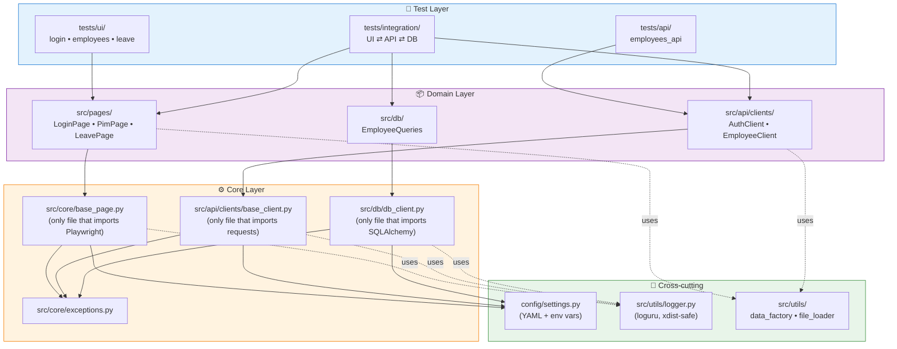
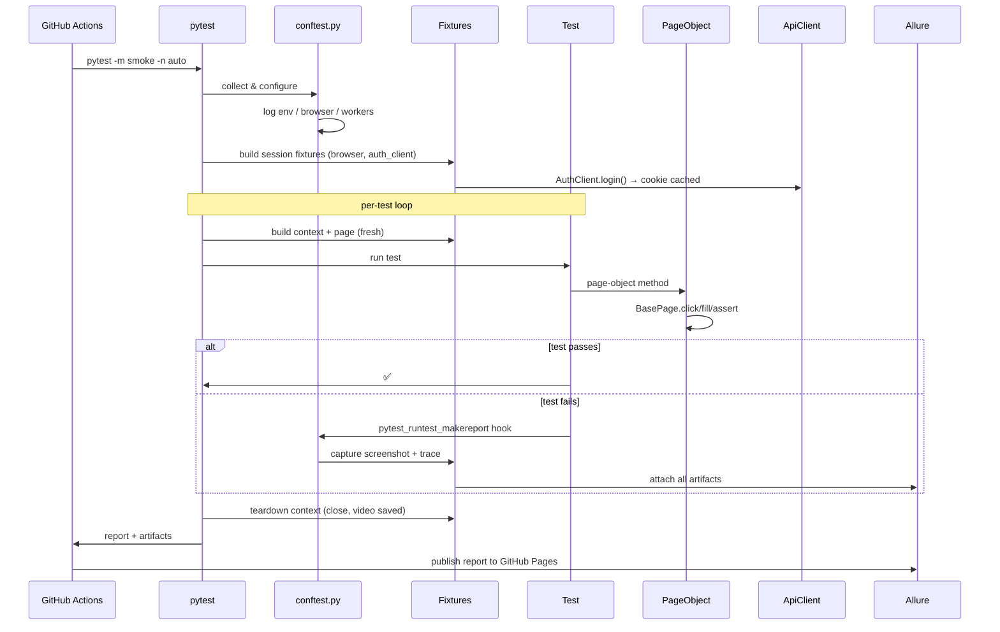
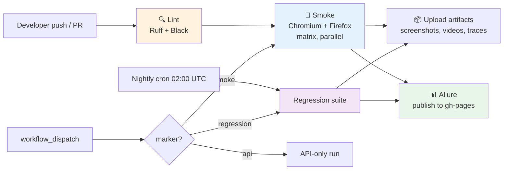

# Architecture Diagrams

GitHub renders Mermaid blocks natively, so these show up as real diagrams in the rendered Markdown.

## 1. Layered architecture & dependency flow

**Reading the diagram:** dependencies flow downward only. A test never imports another test, a page object never imports a test, core never imports a page object. This one rule is what makes the framework refactor-friendly at scale.

---

## 2. Test execution lifecycle

---

## 3. CI/CD pipeline

